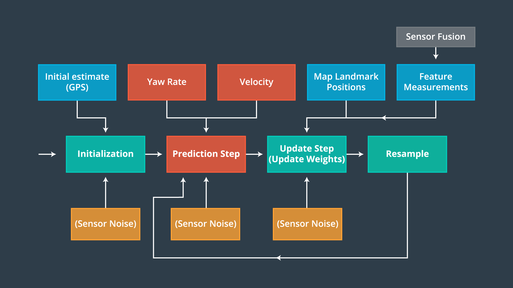

# **Kidnapped Vehicle**

#### Udacity Self Driving Car Engineer Nanodegree Program - Term 2

## Project Introduction
Your robot has been kidnapped and transported to a new location! Luckily it has a map of this location, a (noisy) GPS estimate of its initial location, and lots of (noisy) sensor and control data.

The aim of the project is to determine as accurately as possible the current position and orientation of a moving car on a known map using sensors.
However, the car's GPS sensor can only determine the position with an accuracy of about 10 meters, but that's far too rough to keep the car in its intended lane.
To determine the position more accurately, additional LIDAR sensors are used to measure the distances to objects near the vehicle (sensor range).
Based on the measured distances and the distances to known objects on the map, the most probable position and orientation of the car can be calculated by means of the [Bayes theorem](https://en.wikipedia.org/wiki/Bayes%27_theorem), by matching the positions of the measured and the known objects (landmarks) of the map.

(Source: Udacity Self Driving Car Engineer Nanodegree Program)

For this purpose, a [Particle Filter](https://en.wikipedia.org/wiki/Particle_filter) ([Monte Carlo localization algorithm](https://en.wikipedia.org/wiki/Monte_Carlo_localization), which is based on the [Bayesian filter](https://en.wikipedia.org/wiki/Recursive_Bayesian_estimation)) is implemented in C++.

(Source: Udacity Self Driving Car Engineer Nanodegree Program)

1. Initialisation Step: In the initialization step, the particles are randomly placed near the position reported by the GPS sensor.
In the following steps, the positions are adjusted more and more to the actual position to locate our vehicle.

2. Prediction Step: During the prediction step we predict the new position of the particles based on the last position and the control signals (velocity, yaw rate) and a process noise.

3. Update Step: During the update step, we update our particle weights using map landmark positions and feature measurements.

4. Resample Step: Creation of new particles, whereby the particles with higher weight are correspondingly more frequently represented (resampling wheel).

### Prerequisites
To compile this project the following programming environment is required:

* cmake >= 3.5
  * All OSes: [click here for installation instructions](https://cmake.org/install/)
* make >= 4.1 (Linux, Mac), 3.81 (Windows)
  * Linux: make is installed by default on most Linux distros
  * Mac: [install Xcode command line tools to get make](https://developer.apple.com/xcode/features/)
  * Windows: [Click here for installation instructions](http://gnuwin32.sourceforge.net/packages/make.htm)
* gcc/g++ >= 5.4
  * Linux: gcc / g++ is installed by default on most Linux distros
  * Mac: same deal as make - [install Xcode command line tools](https://developer.apple.com/xcode/features/)
  * Windows: recommend using [MinGW](http://www.mingw.org/)
  
* [uWebSocketIO](https://github.com/uWebSockets/uWebSockets) library for either Linux or Mac systems. For windows you can use either Docker, VMware, or even [Windows 10 Bash on Ubuntu](https://www.howtogeek.com/249966/how-to-install-and-use-the-linux-bash-shell-on-windows-10/) to install uWebSocketIO.

To test the project, you need the Term 2 Simulator from Udacity, which you can download [here](https://github.com/udacity/self-driving-car-sim/releases).

### Compiling and executing
Follow these instructions to compile and run this project:

1. Clone this repo (https://github.com/aboerzel/Kidnapped-Vehicle).
2. Make a build subdirectory and change to it with: `mkdir build && cd build`
3. Compile the project using the command: `cmake .. && make` 
   * On windows, you may need to run: `cmake .. -G "Unix Makefiles" && make`
4. Run the project with: `./particle_filter`

### Running the Particle Filter
Follow these instructions to test the project:

1. Run the particle filter project from the build subdirectory with command: `./particle_filter`
2. Run the [Simulator](https://github.com/udacity/self-driving-car-sim/releases) and select `Project 3: Kidnapped Vehicle` 
3. Press the `Start` button.

The car moves around on the given map and shows the real position. 
The black circles are the known landmarks and the green lines are the sensor measurements that were taken from the current car position.
The blue circle shows the car position estimated by the particle filter, this must move continuously with the car!

The following video shows a test run:

